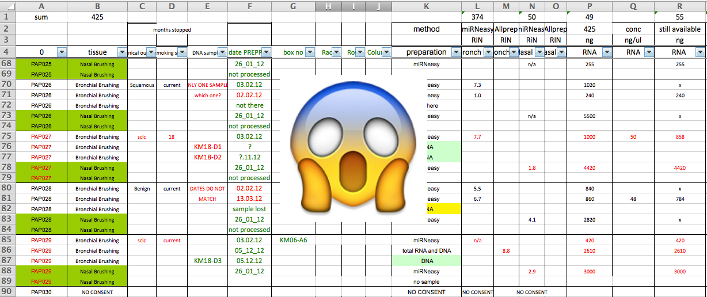

```{r setup, include=FALSE}
knitr::opts_chunk$set(echo = FALSE)
```
 
# Introduction and Motivation


## Reproducibility Crisis


## Reproducible Research

- At some point in the future, someone, somewhere, might want to repeat your analysis for themselves or re-use your data. 
    + which will most likely be ***you!***
- Assuming that you'll be able to remember all the steps involved is dangerous, so making sure that everything is well-documented is key. 
- Florian Markowetz - 5 Selfish Reasons to work reproducibly
  + [https://youtu.be/Is15CMVPHas](https://youtu.be/Is15CMVPHas)

## Why share data?

- Build research profile
- Demonstrate validity of results
- Contribute to the community
- Because you have to!


## How to share data

- Domain-specific repository is best
- https://www.re3data.org/ Registry of Research Data Repositories
    + Gene Expression Omnibus
    + ArrayExpress
    + European Genome Archive
- Your website
- Figshare, Zenodo, institutional repository
- **Have a data management plan in place from the start**

## Things can go wrong


Fire at CRUK Manchester - April 2017

## Things can go wrong


## Data Backup


Credit: CRUK_CI Bioinformatics Core 


## Data Backup


Credit: CRUK_CI Bioinformatics Core   

## Version Control


Credit: PhD Comics


## Version Control


Credit: CRUK_CI Bioinformatics Core    
 
## More advanced Options


- Consider learning about git and github for version control
- Automatic tracking of changes, person that made the changes and the reasons for it
- Interacts nicely with RStudio
- For more, see here:- [Friendly Github Intro](https://kirstiejane.github.io/friendly-github-intro/)
    
## Naming of files and directories


    

## Naming of files and directories


Credit: CRUK_CI Bioinformatics Core

## Naming of files and directories


Credit: CRUK_CI Bioinformatics Core


## The files themselves

- Before attempting analysis, make sure your files don't look like this:-




## Should we stop using Excel completely?

- ....Not neccesarily.
- Often much more convenient to eye-ball a spreadsheet and get an overall impression of your data. 
- But they have *limitations* making them not ideal for large-scale analyses. 
- Doing things by-hand only invites you to make copy-and-paste errors etc

## More Information

https://datacarpentry.org/spreadsheet-ecology-lesson/


## Learn R!


## Discussion

- In your breakout groups discuss
    + what kind of research data do you have?
    + what backup strategies do you have?
    + do you use *version control*?
    + how do you share files / data with collaborators?
    
